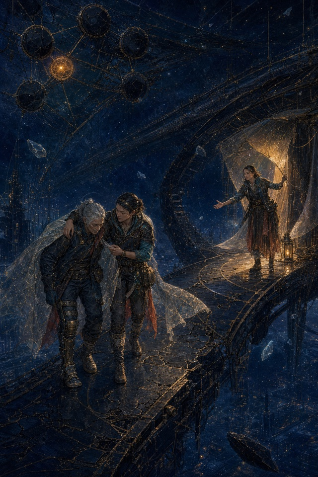

# 原创塔罗牌库设计规格

日期：2026-07-13

状态：视觉方向与完整设计已获用户批准；等待用户审阅本书面规格后进入实现计划

范围：第三模块“牌库”，不包含第四模块“聊天”

## 1. 目标

把当前 `/library` 占位页建设为一套可浏览、搜索和阅读详情的完整 78 张原创塔罗牌库，并为未来 `/chat/[cardId]` 提供稳定的卡牌身份、故事背景和人物关系。

本模块交付内容：

- 78 张原创正面牌面，每张均为完整人物与故事场景插画。
- 牌库首页 `/library`。
- 卡牌详情页 `/library/[cardId]`。
- 搜索、分类筛选、正逆位牌意、移动端和可访问性。
- 图片优化、占位、失败降级和数据完整性验证。
- 可追溯的原创设计及生成记录。

本模块不包含：

- `/chat`、`/chat/[cardId]`、`/chat/group` 的实现。
- 卡牌聊天人格、聊天状态、群聊规则或 DeepSeek 对话接入。
- 登录、收藏、历史记录、数据库和云端图片服务。
- 修改 `.env.local`、普通抽牌和手势抽牌的业务流程。

## 2. 现有项目约束

- `lib/tarot-cards.ts` 已包含完整 78 张卡牌的中文名、英文名、关键词、正位牌意和逆位牌意。
- `TarotCard.id` 的数字 `1–78` 已被普通抽牌、每日一牌、手势抽牌和解读请求复用，是唯一 canonical card identity。
- `/library`、`/chat`、`/chat/[cardId]`、`/chat/group` 当前均为占位页。
- 牌库必须保持现有深蓝、金色、玻璃与星空界面的整体产品语言，但牌面自身采用本规格定义的原创视觉系统。
- 不得为了图片资源建立第二套字符串 slug 身份，也不得更改现有卡牌 ID。

## 3. 已确认的视觉系统

### 3.1 世界组织

78 张牌共同属于一个“中西融合的原创星际神话文明”。大阿尔卡纳记录文明的关键人物与历史转折；四组小阿尔卡纳记录同一文明的行动、情感、思想和资源系统。

不同卡牌可以复用人物、城市、组织和历史事件，从而形成连续世界，而不是 78 张互不相关的风格插画。

### 3.2 共同画面规则

- 材质：漆金暗彩浮雕。使用深色漆面、细密凸金线、矿物色和宝石高光，但必须保留人物、空气和环境的体积感。
- 色彩：宇宙漆彩。深靛蓝为共同底色；每张牌设置一个主彩焦点；金色控制在约 10%，只用于结构、能量与神圣节点。
- 构图：电影式场景叙事。环境占画面约 55–65%，人物完整可见，避免正中站桩和祭坛式对称。
- 画幅：竖版 `2:3`，无标题、数字、边框、商标和水印。
- 正逆位：每张牌只有一张正面资源。画面需要包含可支持正逆两种解释的张力，但不额外生成逆位图片。牌库详情不旋转牌面；未来抽牌场景可按 orientation 旋转同一资源。
- 原创边界：只保留塔罗结构和牌意，不使用、临摹、改造或输入任何现成塔罗牌、艺术家作品、版权不明素材和用户购课资料。

### 3.3 花色符号系统

| 体系 | 原创符号 | 主色 | 叙事领域 |
| --- | --- | --- | --- |
| 大阿尔卡纳 | 不设统一花色物件，以文明历史节点区分 | 随牌意变化 | 关键人物、制度、灾变与觉醒 |
| 权杖 | 火种脉杆、彗火导体 | 珊瑚、琥珀 | 行动、创造、野心与生命力 |
| 圣杯 | 潮汐容器、记忆透镜 | 青绿、孔雀蓝 | 情感、关系、直觉与记忆 |
| 宝剑 | 誓光刃、晶体切面 | 冰蓝、紫晶 | 思考、语言、冲突与判断 |
| 星币 | 星核印、轨道矿石 | 暗金、氧化绿 | 资源、身体、劳动与现实结构 |

数字牌必须准确呈现相应数量的花色符号。宫廷牌以角色身份为主，至少出现一个清晰花色符号。符号不得变成传统五芒星、普通硬币、传统高脚杯或直接复刻的中世纪武器。

## 4. 三张已批准样牌

三张样牌当前为设计预览，不直接作为网页运行时资源。进入实现后需要从原始 PNG 建立正式源文件、WebP 资源和 provenance 记录。

| Card ID | 样牌 | 验证目标 | 预览 |
| --- | --- | --- | --- |
| `1` | 愚者 | 主角、世界观、主动冒险和电影式环境 | [预览](assets/original-tarot-library/fool-preview.jpg) |
| `49` | 圣杯皇后 | 成年人物、原创服饰、克制情绪和圣杯体系 | [预览](assets/original-tarot-library/queen-of-cups-preview.jpg) |
| `69` | 星币五 | 多人动作、困境叙事、帮助路径和星币数量 | [预览](assets/original-tarot-library/five-of-pentacles-preview.jpg) |




### 4.1 样牌 provenance 快照

生成日期均为 2026-07-13，使用内置图像生成能力。未输入外部图片。

| Card ID | 外部参考 | 内部风格参考 | 原始 PNG SHA-256 | 文档预览 SHA-256 |
| --- | --- | --- | --- | --- |
| `1` | 无 | 无 | `c0fd371caea23fa915a1934346051d1b68958afb4799c8277be722866be530e4` | `f896c245000eef1e6c20434a76dcce49495709b6dc7cdae467b786c37a124d04` |
| `49` | 无 | 愚者，仅用于共享材质与世界 | `edc94455d1d0e29f6c58b9aed8ae9d84bb7db9814c427be0e37f95f06d15a7bc` | `42fd9779edd6b37e8c37062a8282d6da21a523b47bff94f54d740786c307f21e` |
| `69` | 无 | 愚者与圣杯皇后，仅用于共享材质与世界 | `aacee379ad1177f0578789fde50f59d0bb3b28826bef4975d6295a0fda3676a7` | `c624ec0ffe75d8a11b8716fc2ad86a79aed24cb0a315a8d5ca914521b790fdd8` |

样牌场景约束：

- 愚者：星行者在失重渡桥尚未完全凝结时迈向新生星门；不使用悬崖、狗、包袱、白玫瑰和传统愚者服饰。
- 圣杯皇后：成熟女性在潮汐记忆库中触碰液态记忆球；不使用海边王座、传统圣杯、皇冠和中世纪皇后服饰。
- 星币五：资源环城断电后，两名受困者相互搀扶，第三人打开庇护；不使用教堂窗、雪地乞者、拐杖和普通硬币。

## 5. 78 张资源生产策略

### 5.1 先建立完整 art manifest

生成剩余 75 张前，必须先建立 78 条完整 brief。每条记录至少包含：

```ts
type TarotArtBrief = {
  cardId: number;
  archetype: string;
  sceneSummary: string;
  characters: string[];
  location: string;
  dominantColor: string;
  suitSymbol: string | null;
  requiredSymbolCount: number | null;
  uprightVisualCue: string;
  reversedVisualCue: string;
  internalStyleReferences: number[];
  requiredElements: string[];
  forbiddenElements: string[];
};
```

该 manifest 是生成提示词和人工验收的共同来源。禁止只用“牌名 + 统一风格”批量生成，因为那会造成传统图像回流、人物重复和花色数量错误。

### 5.2 批次顺序

样牌已经覆盖大阿尔卡纳、圣杯和星币。剩余 75 张分五批：

1. 大阿尔卡纳剩余 21 张。
2. 权杖 14 张。
3. 圣杯剩余 13 张。
4. 宝剑 14 张。
5. 星币剩余 13 张。

批次内部不设置逐张用户确认。每批完成后执行内部 QA；只有出现系统性风格漂移、人物结构问题或符号计数错误时才暂停整批修正。

### 5.3 单张验收标准

- 竖版 `1024 × 1536` 或更高的 `2:3` 源图。
- 人物动作和表情能承载牌意，不依赖传统塔罗物件解释。
- 完整人物符合 brief；手、脚、肢体和人物数量正确。
- 数字牌的原创花色符号数量准确且可辨认。
- 首屏缩略图尺寸下能先读到人物、主光和核心事件。
- 深靛共同底色、单一主彩和约 10% 金色控制成立。
- 不出现文字、数字、商标、水印和牌框。
- 不出现禁止元素、现成牌面构图或可识别版权角色。
- 通过源文件、运行时文件和 provenance 三者对应检查。

### 5.4 文件策略

- 原始 PNG：`artwork-source/tarot/<cardId>.png`。该目录不进入 Next.js 运行时，也不直接提交普通 Git；在删除任何生成缓存前，必须完整备份到本地源文件归档。
- 网页资源：`public/images/tarot/cards/<cardId>.webp`，统一 `2:3`，最长边 1536，目标文件大小不超过 600 KB。
- 文档 provenance：`docs/tarot-art-provenance.json`，提交 Git。
- 网页缩略图由 `next/image` 按 `sizes` 生成，不再手工维护第二套 78 张缩略图。
- 生产批次只有在源 PNG、WebP、SHA-256 和 provenance 都存在后才算完成。

### 5.5 Provenance 字段

每张最终图片至少记录：

```ts
type TarotArtProvenance = {
  cardId: number;
  createdAt: string;
  generator: string;
  prompt: string;
  externalInputs: string[];
  internalReferenceCardIds: number[];
  sourceSha256: string;
  webSha256: string;
  humanReview: {
    anatomy: "pass" | "fail";
    symbolCount: "pass" | "fail" | "not-applicable";
    styleConsistency: "pass" | "fail";
    forbiddenElements: "pass" | "fail";
  };
};
```

“未主动参考现成作品”不能证明生成结果与世界上所有作品零相似。商业发布前仍需人工相似性检查；高风险商业用途应另行进行法律审查。本项目不得宣传为“已证明绝对无版权风险”。

## 6. 数据与模块边界

### 6.1 Canonical card data

`lib/tarot-cards.ts` 继续负责：

- `id`、中英文名、arcana、suit、number。
- keywords、正位牌意和逆位牌意。
- `getTarotCardById()`。

不改动现有数字 ID，不把图片路径、生成提示词或页面状态塞入该文件。

### 6.2 Library metadata

新增 `lib/tarot-library.ts`，只保存运行时需要的视觉与世界信息：

```ts
type TarotLibraryEntry = {
  cardId: number;
  imagePath: string;
  imageAlt: string;
  story: string;
  sceneSummary: string;
  characters: string[];
  location: string;
  symbols: string[];
  dominantColor: string;
};
```

该文件导出完整 78 条映射和 `getTarotLibraryEntry(cardId)`。构建测试必须验证它与 `tarotCards` 一一对应。

### 6.3 组件边界

```text
app/library/page.tsx
  -> components/library/LibraryBrowser.tsx
     -> LibraryFilters.tsx
     -> TarotCardGrid.tsx
        -> TarotLibraryCard.tsx

app/library/[cardId]/page.tsx
  -> getTarotCardById(cardId)
  -> getTarotLibraryEntry(cardId)
  -> TarotCardArtwork.tsx
  -> TarotMeaningTabs.tsx
  -> TarotStoryPanel.tsx
  -> TarotDetailNavigation.tsx
```

- 路由页负责解析数字 ID、组合语义数据与视觉数据、处理 `notFound()`。
- `LibraryBrowser` 只负责本地搜索、筛选和 URL 状态。
- `TarotCardArtwork` 只负责图片、比例、placeholder 和加载失败降级。
- `TarotMeaningTabs` 只负责正逆位切换，不决定抽牌 orientation。
- 页面组件不读取 provenance，也不包含聊天状态。

## 7. `/library` 信息架构

页面顺序：

1. 标题与一句世界观说明。
2. 完成度固定显示“78 张原创牌组”。未达到 78 张时开发版本显示实际资源数量，但发布版本不得伪称完成。
3. 搜索框。
4. 大阿尔卡纳／小阿尔卡纳和四花色筛选。
5. 当前结果数量与清空筛选。
6. 牌面网格。
7. 无结果状态。

搜索范围：`name_cn`、`name_en`、`keywords`、`meaning_upright`、`meaning_reversed`。首版不加入拼音、模糊搜索和复杂排序。

URL 参数：

- `q`：搜索文本。
- `arcana`：`all | major | minor`。
- `suit`：`all | wands | cups | swords | pentacles`。

无效参数回退为 `all`，不抛出页面错误。结果始终按现有 `cardId` 顺序排列。搜索和筛选完全在前端静态数据上完成，不请求 API。

卡片网格首屏展示牌面、中文名、英文名、类别和关键词。详细牌意与世界故事放在详情页，避免每张缩略卡信息过载。

## 8. `/library/[cardId]` 详情页

- `cardId` 只接受十进制数字字符串。
- 使用 `generateStaticParams()` 生成 `1–78`。
- ID 非法、超出范围、语义数据缺失或视觉映射缺失时调用 `notFound()`；图片文件临时加载失败不触发 404。
- 桌面端为左侧牌面、右侧信息；移动端先牌面、后信息。
- 信息顺序：名称、类别、关键词、正逆位、世界故事、人物与地点、符号说明、上一张／下一张。
- 正逆位使用可访问的 tabs；默认正位，切换不改 URL，也不随机旋转图片。
- 上一张／下一张在 `1` 和 `78` 的边界禁用，不循环，避免用户误以为牌组是无限循环。

## 9. 移动端、交互与可访问性

- 牌面容器固定 `aspect-ratio: 2 / 3`，避免 CLS。
- 360 px 及以上默认双列；更窄屏幕单列；平板三列；桌面根据容器宽度增加到四至六列。
- 筛选控件单行横向滚动，不压缩成难点按的小按钮。
- 所有可点击区域至少 44 px，提供可见焦点样式。
- 不把关键词和动作只放在 hover；触屏和键盘必须能获取同等信息。
- `imageAlt` 使用“卡名 + 原创场景摘要”，不重复堆砌牌意。
- 尊重 `prefers-reduced-motion`，关闭牌面浮起和大幅视差。
- 缩略卡文字、筛选状态和正逆位 tabs 满足可读对比度。

## 10. 图片性能与失败处理

- 使用 `next/image`、正确的 `sizes` 和懒加载。
- 首屏只将最前方可见卡片设为 priority，其余均为 lazy；禁止 78 张全部 eager。
- 运行时只引用 WebP，不直接引用原始 PNG。
- 图片加载前显示与花色匹配的低对比度漆面 placeholder，保持 `2:3` 尺寸。
- 图片加载失败后显示本地统一占位牌、卡名和“牌面暂不可用”，牌意和导航继续可用。
- 失败处理不得无限重试，不允许 broken-image 图标破坏布局。
- 搜索无结果时显示当前条件和“清空筛选”；不能显示空白网格。

## 11. 与聊天模块的边界

- 牌库通过稳定数字 `cardId` 为未来聊天提供入口条件。
- 牌库的 `story`、`characters`、`location` 和 `symbols` 可供第四模块构建人格，但本模块不定义聊天 prompt。
- 本阶段详情页不渲染可点击的“与此牌对话”按钮，也不跳转占位聊天页。
- 第四模块实施时，可在 feature flag 开启后增加 `/chat/${cardId}` 链接；不需要迁移牌库数据或修改卡牌身份。
- `/chat/group` 的群聊角色组合不属于本规格。

## 12. 测试与验证

### 12.1 数据完整性

- `tarotCards.length === 78`。
- ID 唯一且连续为 `1–78`。
- 22 张大阿尔卡纳，四花色各 14 张。
- 每张都有正位、逆位和至少一个关键词。
- 每个 card ID 都有唯一 `TarotLibraryEntry`。
- 每个运行时图片路径都存在。
- provenance、源文件和 WebP 的 SHA-256 与记录一致。
- 数字牌的符号计数经人工复核通过。

### 12.2 行为验证

- 中文名、英文名、关键词和牌意搜索均有效。
- arcana 与 suit 筛选可组合，URL 前进后退能恢复状态。
- 无效 query 参数安全回退。
- 正逆位 tabs、上一张／下一张、清空筛选和无结果状态正确。
- 缺图占位不影响牌意阅读。
- `/library/1`、`/library/49`、`/library/69` 和一个无效 ID 分别返回预期结果。

### 12.3 工程验证顺序

1. `npm run build`
2. `npx tsc --noEmit`
3. `npm run lint`
4. HTTP 检查 `/library` 与代表性详情路由
5. 桌面和移动端视觉检查

本项目的 `.next/types` 在构建后更稳定，因此 TypeScript 验证放在 build 之后。

## 13. 实施顺序与发布门槛

实现计划应拆成以下阶段：

1. 建立 78 条 art brief、运行时 metadata 类型和 provenance 格式。
2. 迁移三张批准样牌，建立源图到 WebP 的优化流程。
3. 实现 `/library`、详情路由、搜索筛选、正逆位和失败占位。
4. 按五批生成剩余 75 张，批次内部自动推进并执行 QA。
5. 生成 WebP、补全 metadata 和 provenance。
6. 完整数据、工程、HTTP、移动端和视觉验证。

发布为“完整牌库”前必须同时满足：

- 78 张运行时牌面全部存在。
- 78 条 metadata 和 provenance 完整。
- 所有数据与工程验证通过。
- 没有传统牌面复刻、版权不明输入和未处理的明显相似性风险。
- 聊天路由仍保持第四模块边界。

在这些条件未满足前，可以本地开发和预览，但不得把页面文案标注为“完整 78 张已上线”。
